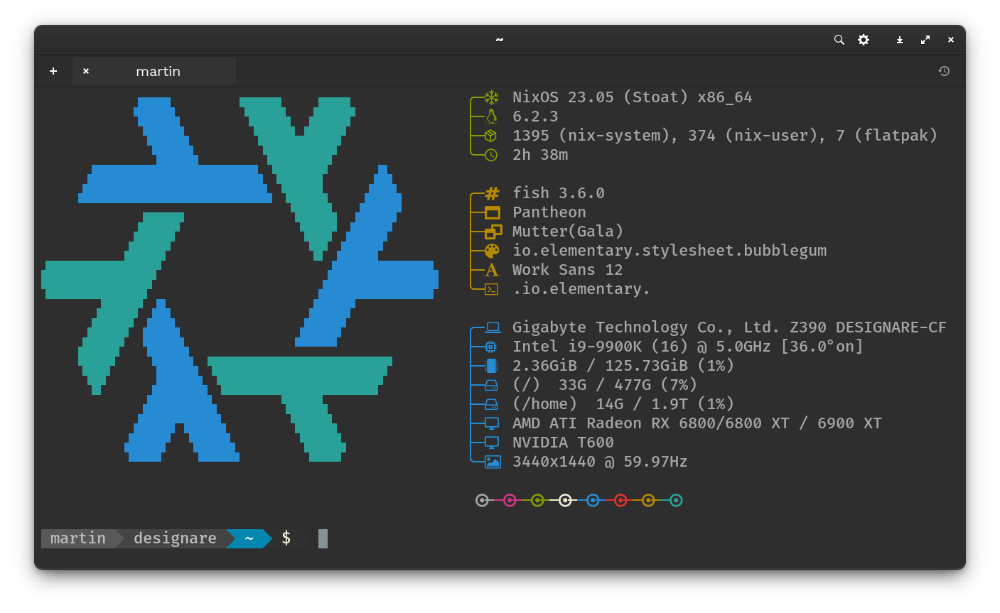

# Wimpy's [NixOS]  & [Home Manager] Configurations

[NixOS]: https://nixos.org/
[Home Manager]: https://github.com/nix-community/home-manager

This repository contains a [Nix Flake](https://nixos.wiki/wiki/Flakes) for configuring my computers and home environment. These are the computers this configuration currently manages:

|    Hostname    |       OEM      |        Model        |       OS      |     Role     |  Status  |
| :------------: | :------------: | :-----------------: | :-----------: | :----------: | :------- |
| `designare`    | DIY            | i9-9900K            | NixOS         | Desktop      | Done     |
| `noname`       | DIY            | AMD 5900X, 6900 XT  | NixOS         | Gamestation  | Done     |
| `node202`      | DIY            | AMD 5700G, 6700 XT  | ChimeraOS     | Gamestation  | Done     |
| `vm`           | VM             | n/a                 | NixOS         | Desktop      | Done     |
| `ripper`       | DIY            | AMD 3970X           | elementary OS | Desktop      | WIP      |
| `skull`        | Intel          | NUC6i7KYK           | NixOS         | Server       | WIP      |
| `brix`         | Gigabyte       | BRIX                | NixOS         | Server       | tbd      |
| `trooper`      | DIY            | AMD 5950X, 3080Ti   | NixOS         | Desktop      | Done     |
| `zed`          | Lenovo         | ThinkPad Z13 Gen 1  | NixOS         | Laptop       | Done     |
| `p1`           | Lenovo         | ThinkPad P1 Gen 1   | NixOS         | Laptop       | WIP      |
| `pi4`          | Raspberry Pi   | Raspberry Pi 4      | NixOS         | Desktop      | tbd      |
| `pinebook`     | Pine64         | Pinebook            | NixOS         | Laptop       | tbd      |
| `pinebook-pro` | Pine64         | Pinebook Pro        | NixOS         | Laptop       | tbd      |
| `c630`         | Lenovo         | Yoga C630           | NixOS         | Laptop       | tbd      |
| `pocket`       | GPD            | Pocket              | NixOS         | Laptop       | tbd      |
| `pocket2`      | GPD            | Pocket 2            | NixOS         | Laptop       | tbd      |
| `pocket3`      | GPD            | Pocket 3            | NixOS         | Laptop       | tbd      |
| `p2`           | GPD            | P2 Max              | NixOS         | Laptop       | tbd      |
| `micropc`      | GPD            | Micro PC            | NixOS         | Laptop       | tbd      |
| `win`          | GPD            | WIN                 | NixOS         | Laptop       | tbd      |
| `win-max`      | GPD            | WIN Max             | NixOS         | Laptop       | tbd      |
| `falcon`       | TopJoy         | Falcon              | NixOS         | Laptop       | tbd      |
| `macbookpro`   | Apple          | Macbook Pro 2015    | macOS         | Laptop       | tbd      |
| `xps`          | Dell           | XPS 13              | Ubuntu MATE   | Laptop       | tbd      |
| `spectre`      | HP             | Spectre             | Ubuntu MATE   | Laptop       | tbd      |
| `?`            | Entroware      | ?                   | NixOS         | Laptop       | tbd      |

## Structure

- [home-manager]: Home Manager configurations
  - Sane defaults for shell and desktop
- [nixos]: NixOS configurations
  - Includes discrete hardware configurations which leverage the [NixOS Hardware modules](https://github.com/NixOS/nixos-hardware) via [flake.nix].
- [scripts]: Helper scripts

The [nixos/_mixins] and [home-manager/_mixins] are a collection of generic configurations that are composited based on the arguments defined in [flake.nix].

[home-manager]: ./home-manager
[nixos]: ./nixos
[nixos/_mixins]: ./nixos/_mixins
[home-manager/_mixins]: ./home-manager/_mixins
[flake.nix]: ./flake.nix
[scripts]: ./scripts

## Installing 💾

This is a work in progress 😅 I'm working towards making the installation entirely automated.

- Boot off a .iso image created by this flake using `rebuild-iso` (*see below*).
- Put the .iso image on a USB drive
- Boot the target computer from the USB drive
- Clone my nix-config

```bash
git clone https://github.com/wimpysworld/nix-config.git
```

- Run the install script 📜
 - The install script uses [Disko] to automatically partition and format the disks then uses my flake via `nixos-install` to complete a full system installation

```bash
cd nix-config
scripts/install.sh <hostname> <username>
```

- Make a cuppa 🫖
- Reboot


## Applying Changes ✨

I clone this repo to `~/Zero/nix-config`. Home Manager and NixOS changes can be applied separately because I am planning to add support for some non-NixOS hosts.

```bash
gh repo clone wimpysworld/nix-config ~/Zero/nix-config
```

### NixOS ❄️

A `rebuild-host` alias is provided, that does the following:

```bash
sudo nixos-rebuild switch --flake $HOME/Zero/nix-config
```

### Home Manager 🏠️

A `rebuild-home` alias is provided, that does the following:

```bash
home-manager switch -b backup --flake $HOME/Zero/nix-config
```

### ISO 📀

A `rebuild-iso` alias is provided, that does the following:

```bash
pushd $HOME/Zero/nix-config
nix build .#nixosConfigurations.iso.config.system.build.isoImage
popd
```

A live image will be left in `~/$HOME/Zero/nix-config/result/iso/`

## What's in the box? 🎁

Nix is configured with [flake support](https://zero-to-nix.com/concepts/flakes) and the [unified CLI](https://zero-to-nix.com/concepts/nix#unified-cli) enabled.

### Structure

This is the directory structure I'm using.

```
.
├── home-manager
│   ├── _mixins
│   │   ├── console
│   │   └── desktop
│   └── default.nix
├── nixos
│   ├── _mixins
│   │   ├── base
│   │   ├── boxes
│   │   ├── desktop
│   │   ├── services
│   │   └── users
│   ├── designare
│   ├── generic
│   ├── skull
│   ├── z13
│   └── default.nix
├── overlays
├── pkgs
├── scripts
└── flake.nix
```

### The Shell 🐚

[Fish shell] with [powerline-go](https://github.com/justjanne/powerline-go) and a collection of tools that deliver a somewhat *"[Modern Unix]"* experience. The base system has a firewall enabled and also includes [OpenSSH], [Tailscale], [Podman & Distrobox] and, of course, a delightfully configured [nano]. (*Fight me!* 🥊)

[Fish shell]: ./home-manager/_mixins/console/fish.nix
[Modern Unix]: ./home-manager/_mixins/console/default.nix
[OpenSSH]: ./nixos/_mixins/services/openssh.nix
[Tailscale]: ./nixos/_mixins/services/tailscale.nix
[Podman & Distrobox]: ./nixos/_mixins/boxes/podman.nix
[nano]: ./nixos/_mixins/base/nano.nix



### The Desktop 🖥️

MATE Desktop 🧉 and Pantheon 🏛️ are the two desktop options available. The [font configuration] is common with both desktops using [Work Sans](https://fonts.google.com/specimen/Work+Sans) and [Fira Code](https://fonts.google.com/specimen/Fira+Code). The usual creature comforts you'd expect to find in a Linux Desktop are integrated such as [Pipewire], Bluetooth, [Avahi], [CUPS], [SANE] and [NetworkManager].

[font configuration]: ./nixos/_mixins/desktop/default.nix
[Pipewire]: ./nixos/_mixins/services/pipewire.nix
[Avahi]: ./nixos/_mixins/services/avahi.nix
[CUPS]: ./nixos/_mixins/services/cups.nix
[SANE]: ./nixos/_mixins/services/sane.nix
[NetworkManager]: ./nixos/_mixins/services/networkmanager.nix

|  Desktop  |       System       |       Configuration       |             Theme            |
| :-------: | :----------------: | :-----------------------: | :--------------------------: |
| MATE      | [MATE Install]     | [MATE Configuration]      | Yaru Magenta (Dark)          |
| Pantheon  | [Pantheon Install] | [Pantheon Configuration]  | elementary Bubble Gum (Dark) |

[MATE Install]: ./nixos/_mixins/desktop/mate.nix
[Pantheon Install]: ./nixos/_mixins/desktop/pantheon.nix
[MATE Configuration]: ./home-manager/_mixins/desktop/mate.nix
[Pantheon Configuration]: ./home-manager/_mixins/desktop/pantheon.nix

## Eye Candy 👀🍬


## TODO 🗒️

### Hardware

- [x] Add all computers to the table
- [x] Implement [Disko](https://github.com/nix-community/disko) partitioning
- [x] Integrate [.iso building](https://www.reddit.com/r/NixOS/comments/y1xo2u/comment/irzwe95/)
- [x] Integrate OpenRGB
- [x] Integrate OpenRazer
- [ ] Integrate StreamDeck
- [x] Integrate Xone
- [ ] Migrate (*maybe*) to ZFS, with backups via [`zrepl`](https://zrepl.github.io/)
- [x] Fix Magewell driver: [nixpkgs#221209](https://github.com/NixOS/nixpkgs/pull/221209)

### Applications

- [x] Integrate an Emoji picker
- [x] Integrate AppCenter and Flathub
- [ ] Integrate Steam

### Services

- [ ] Integrate cockpit
- [x] Integrate fwupd
- [x] Integrate Keybase
- [ ] Integrate nullmailer
- [ ] Integrate Syncthing
- [ ] Integrate sshguard

### Configuration

- [x] Embed [install script in the ISO](./nixos/_mixins/users/nixos/console.nix)
- [x] Integrate capabilities from [nix-starter-configs](https://github.com/Misterio77/nix-starter-configs)
- [ ] Integrate wallpapers
- [x] Integrate faces
- [ ] Include Serif fonts
- [ ] Include fallback fonts for Work Sans, Fira Code and Joypixels
- [x] Create common user settings and discrete user settings
- [x] Move application defaults out of the desktop defaults
- [x] Fix [Unfree in Home Manager](https://github.com/Misterio77/nix-starter-configs/blob/main/minimal/home-manager/home.nix#L31)

### Shell

- [ ] fzf
- [ ] tmate or tmux
- [x] micro
- [ ] nnn or broot or felix or ranger

## Inspirations 🧑‍🏫

Before preparing my NixOS and Home Manager configurations I took a look at what other Nix users are doing. My colleagues shared their configs and tips which included [nome from Luc Perkins], [nixos-config from Cole Helbling], [flake from Ana Hoverbear] and her [Declarative GNOME configuration with NixOS] blog post. A couple of friends also shared their configurations and here's [Jon Seager's nixos-config] and [Aaron Honeycutt's nix-configs].

While learning Nix I watched some talks/interviews with [Matthew Croughan](https://github.com/MatthewCroughan) and [Will Taylor's Nix tutorials on Youtube](https://www.youtube.com/playlist?list=PL-saUBvIJzOkjAw_vOac75v-x6EzNzZq-). [Will Taylor's dotfiles] are worth a look, as are his videos, and [Matthew Croughan's nixcfg] is also a useful reference. **After I created my initial flake I found [nix-starter-configs](https://github.com/Misterio77/nix-starter-configs) by [Gabriel Fontes](https://m7.rs) which is an excellent starting point**. I'll be incorporating many of the techniques it demonstrates in my nix-config.

I like the directory hierarchy in [Jon Seager's nixos-config] and the mixin pattern used in [Matthew Croughan's nixcfg], so my initial Nix configuration is heavily influenced by both of those. Ana's excellent [Declarative GNOME configuration with NixOS] blog post was essential to get a personalised desktop. That said, there's plenty to learn from browsing other people's Nix configurations, not least for discovering cool software. I recommend a search of [GitHub nixos configuration] from time to time to see what interesting techniques you pick up and new tools you might discover.

The [Disko] implementation and automated installation is chasing the ideas outlined in these blog posts:
  - [Setting up my new laptop: nix style](https://bmcgee.ie/posts/2022/12/setting-up-my-new-laptop-nix-style/)
  - [Setting up my machines: nix style](https://aldoborrero.com/posts/2023/01/15/setting-up-my-machines-nix-style/)

[nome from Luc Perkins]: https://github.com/the-nix-way/nome
[nixos-config from Cole Helbling]: https://github.com/cole-h/nixos-config
[flake from Ana Hoverbear]: https://github.com/Hoverbear-Consulting/flake
[Declarative GNOME configuration with NixOS]: https://hoverbear.org/blog/declarative-gnome-configuration-in-nixos/
[Jon Seager's nixos-config]: https://github.com/jnsgruk/nixos-config
[Aaron Honeycutt's nix-configs]: https://gitlab.com/ahoneybun/nix-configs
[Matthew Croughan's nixcfg]: https://github.com/MatthewCroughan/nixcfg
[Will Taylor's dotfiles]: https://github.com/wiltaylor/dotfiles
[GitHub nixos configuration]: https://github.com/search?q=nixos+configuration
[Disko]: https://github.com/nix-community/disko
