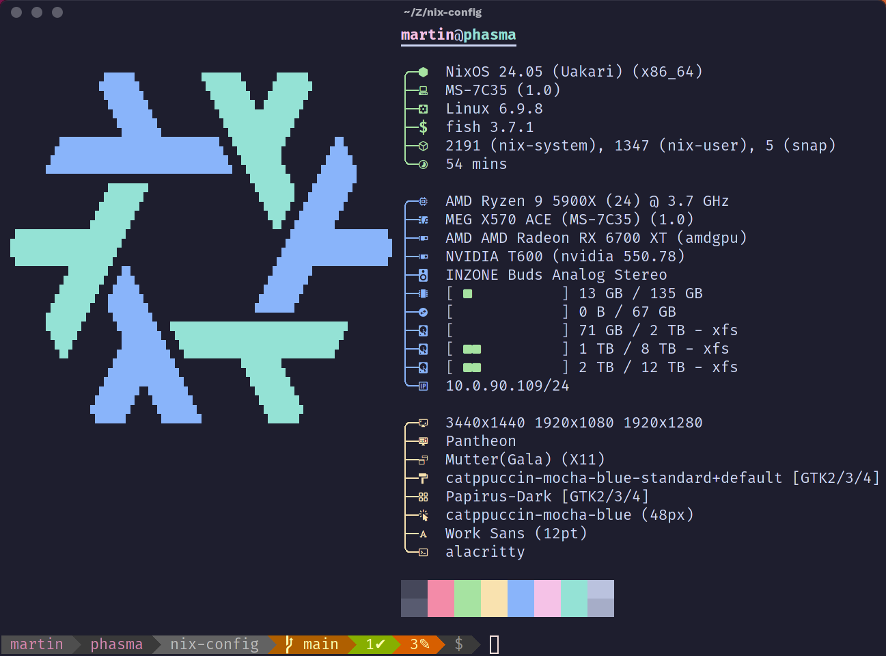

<div align="center">


# Wimpy's [NixOS], [nix-darwin] & [Home Manager] Configurations
<b>Made with 💝 for  & </b>
<br />
</div>

This repository contains a [Nix Flake](https://zero-to-nix.com/concepts/flakes) for configuring my computers and/or their home environment.
It is not intended to be a drop in configuration for your computer, but you are welcome to use it as a reference or starting point for your own configuration.
**If you are looking for a more generic NixOS configuration, I highly recommend [nix-starter-configs](https://github.com/Misterio77/nix-starter-configs).** 👍️
These computers are managed by this Nix flake ❄️

|   Hostname  |            Board            |               CPU              |  RAM  |         Primary GPU         |        Secondary GPU       | Role | OS  | State |
| :---------: | :-------------------------: | :----------------------------: | :---: | :-------------------------: | :------------------------: | :--: | :-: | :---: |
| `vader`     | [MEG-X570-UNIFY]            | [AMD Ryzen 9 5950X]            | 128GB | [Fighter RX 7900 GRE]       | [RTX 2000E Ada Generation] | 🖥️   | ❄️  | ✅    |
| `phasma`    | [MEG-X570-ACE]              | [AMD Ryzen 9 5900X]            | 128GB | [Fighter RX 7900 GRE]       | [RTX 2000E Ada Generation] | 🖥️   | ❄️  | ✅    |
| `sidious`   | [ThinkPad P1 Gen 1]         | [Intel Xeon E-2176M]           | 64GB  | [NVIDIA Quadro P2000 Max-Q] | Intel UHD Graphics P630    | 💻️🎭️ | ❄️  | ✅    |
| `palpatine` | ⤴️                          | ⤴️                             | ⤴️    | ⤴️                          | ⤴️                         | 💻️🎭️ | 🪟  | ✅    |
| `tanis`     | [ThinkPad Z13 Gen 1]        | [AMD Ryzen 5 PRO 6650U]        | 32GB  | AMD Radeon 660M             |                            | 💻️   | ❄️  | ✅    |
| `shaa`      | [ThinkPad T14s Gen 1]       | [AMD Ryzen 5 PRO 4650U]        | 16GB  | AMD Radeon RX Vega 6        |                            | 💻️   | ❄️  | ✅    |
| `momin`     | [Macbook Air M2 15"]        | Apple M2 8-core CPU            | 24GB  | Apple M2 10-core GPU        |                            | 💻️   | 🍏  | ✅    |
| `krall`     | [Macbook Pro (Mid 2015)]    | Intel Core i7                  | 16GB  | Intel Iris Pro Graphics     |                            | 💻️   | 🍏  | ✅    |
| `steamdeck` | [Steam Deck 64GB LCD]       | Zen 2 4c/8t                    | 16GB  | 8 RDNA 2 CUs                |                            | 🎮️   | 🐧  | ✅    |
| `crawler`   | [QEMU]                      | -                              | -     | [VirGL]                     |                            | 🐄   | ❄️  | ✅    |
| `dagger`    | [QEMU]                      | -                              | -     | [VirGL]                     |                            | 🐄   | ❄️  | ✅    |
| `grozbok`   | [Lima]                      | -                              | -     | -                           |                            | 🐄   | 🐧  | ✅    |
| `zeta`      | [Lima]                      | -                              | -     | -                           |                            | 🐄   | 🐧  | ✅    |
| `revan`     | [Z390-DESIGNARE]            | [Intel Core i9-9900K]          | 64GB  | Intel UHD Graphics 630      | [NVIDIA T1000]             | ☁️   | ❄️  | 🚧    |

<!--
| `skull`     | [NUC6i7KYK]                 | [Intel Core i7-6770HQ]         | 64GB  | Intel Iris Pro Graphics 580 |                            | 🧟   | 🧟  | 🧟    |
| `nuc`       | [NUC5i7RYH]                 | [Intel Core i7-5557U]          | 32GB  | Intel Iris Graphics 6100    |                            | 🧟   | 🧟  | 🧟    |
| `brix`      | [GB-BXCEH-2955]             | [Intel Celeron 2955U]          | 16GB  | Intel HD Graphics           |                            | 🧟   | 🧟  | 🧟    |
-->

Workstation and server host names are Sith Lords and the virtual machines are named after TIE fighter series.
Dual boot systems have the NixOS install named a Sith Lord and the *"other"* OS named after their public-facing persona.

**Key**

- 🎭️ : Dual boot
- 🖥️ : Desktop
- 💻️ : Laptop
- 🎮️ : Games Machine
- 🐄 : Virtual Machine
- ☁️ : Server
- 🧟 : Not in service

**As featured on [Linux Matters](https://linuxmatters.sh) podcast!** 🎙️ I am a presenter on Linux Matters and this configuration was featured in [Episode 7 - Immutable Desktop Linux for Anyone](https://linuxmatters.sh/7/).

<div align="center">
  <a href="https://linuxmatters.sh" target="_blank"></a>
  <br />
  <em>Linux Matters Podcast</em>
</div>

## Structure

- [.github]: GitHub CI/CD workflows Nix ❄️ supercharged ⚡️ by [**Determinate Systems**](https://determinate.systems)
  - [Nix Installer Action](https://github.com/marketplace/actions/the-determinate-nix-installer)
  - [Magic Nix Cache Action](https://github.com/marketplace/actions/magic-nix-cache)
  - [Flake Checker Action](https://github.com/marketplace/actions/nix-flake-checker)
  - [Update Flake Lock Action](https://github.com/marketplace/actions/update-flake-lock)
- [darwin]: macOS configurations
  - Includes full system configuration for a MacBook Air M2 15" and MacBook Pro (Mid 2015)
- [home-manager]: Home Manager configurations
  - Sane defaults for shell and desktop
- [nixos]: NixOS configurations
  - Includes discrete hardware configurations that leverage the [NixOS Hardware modules](https://github.com/NixOS/nixos-hardware).

The [nixos/_mixins] and [home-manager/_mixins] are a collection of composited configurations based on the arguments defined in [flake.nix].

## Installing 💾

- Boot off a .iso image created by this flake using `build-iso console` or `build-iso <desktop>` (*see below*)
- Put the .iso image on a USB drive
- Boot the target computer from the USB drive
- Two installation options are available:
  1 Use the graphical Calamares installer to install an ad-hoc system
  2 Run `install-system <hostname> <username>` from a terminal
   - The install script uses [Disko] or `disks.sh` to automatically partition and format the disks, then uses my flake via `nixos-install` to complete a full-system installation
   - This flake is copied to the target user's home directory as `~/Zero/nix-config`
   - The `nixos-enter` command is used to automatically chroot into the new system and apply the Home Manager configuration.
- Make a cuppa 🫖
- Reboot 🥾

## Applying Changes ✨

I clone this repo to `~/Zero/nix-config`. NixOS and Home Manager changes are applied separately because I have some non-NixOS hosts.

```bash
gh repo clone wimpysworld/nix-config ~/Zero/nix-config
```

- ❄️ **NixOS:**  A `build-host` and `switch-host` aliases are provided that build the NixOS configuration and switch to it respectively.
- 🏠️ **Home Manager:**  A `build-home` and `switch-home` aliases are provided that build the Home Manager configuration and switch to it respectively.
- 🌍️ **All:** There are also `build-all` and `switch-all` aliases that build and switch to both the NixOS and Home Manager configurations.

### ISO 📀

The `build-iso` script is included that creates .iso images from this flake. The following modes are available:

- `build-iso console` (*terminal environment*): Includes `install-system` for automated installation.
- `build-iso gnome` (*GNOME Desktop environment*): Includes `install-system` and [Calamares](https://calamares.io/) installation.
- `build-iso mate` (*MATE Desktop environment*): Includes `install-system` and [Calamares](https://calamares.io/) installation.
- `build-iso pantheon` (*Pantheon Desktop environment*): Includes `install-system` and [Calamares](https://calamares.io/) installation.

Live images will be left in `~/$HOME/Zero/nix-config/result/iso/` and are also injected into `~/Quickemu/nixos-console` and `~/Quickemu/nixos-<desktop>` respectively.
The console .iso image is also periodically built and published via [GitHub Actions](./.github/workflows) and is available in [this project's Releases](https://github.com/wimpysworld/nix-config/releases).

## What's in the box? 🎁

Nix is configured with [flake support](https://zero-to-nix.com/concepts/flakes) and the [unified CLI](https://zero-to-nix.com/concepts/nix#unified-cli) enabled.

### Structure

Here's the directory structure I'm using:

```
.
├── darwin
│  ├── _mixins
│  │  ├── desktop
│  │  ├── scripts
│  │  └── users
│  ├── momin
│  ├── krall
│  └── default.nix
├── home-manager
│  ├── _mixins
│  │  ├── configs
│  │  ├── desktop
│  │  ├── features
│  │  ├── scripts
│  │  ├── services
│  │  └── users
│  └── default.nix
├── lib
│  └── default.nix
├── nixos
│  ├── _mixins
│  │  ├── configs
│  │  ├── desktop
│  │  ├── features
│  │  ├── scripts
│  │  ├── services
│  │  └── users
│  ├── iso-console
│  ├── iso-gnome -> iso-console
│  ├── iso-mate -> iso-console
│  ├── iso-pantheon -> iso-console
│  ├── crawler -> dagger
│  ├── phasma
│  ├── revan
│  ├── dagger
│  ├── sidious
│  ├── tanis
│  ├── vader
│  └── default.nix
├── overlays
│  └── default.nix
├── pkgs
│  └── default.nix
├── secrets
│  └── secrets.yaml
└── flake.nix
```

- The NixOS macOS (darwin) and Home Manager configurations are in the `nixos`, `darwin` and `home-manager` directories respectively, they are structured in a similar way with `_mixins` directories that contain the configurations applied via mixin pattern that compose the final configuration.
- The `lib` directory contains helper functions for the `nixos`, `nix-darwin` and `home-manager` configurations.
- The `overlays` directory hold my custom overlays.
- The `pkgs` directory contains my custom local packages.
- The `secrets` directory contains secrets managed by [sops-nix].
- The `default.nix` files in the root of each directory are the entry points.

### The Shell 🐚

Fish shell 🐟️ with [powerline-go](https://github.com/justjanne/powerline-go) and a collection of tools that deliver a *"[Modern Unix]"* experience. The base system has a firewall enabled and also includes [OpenSSH], [sops-nix] for secret management, [Tailscale], [Distrobox](./nixos/_mixins/features/distrobox/default.nix) and, of course, a delightfully configured [micro]. (*Fight me!* 🥊) My own scripts are (slowly) being migrated to [NixOS scripts](./nixos/_mixins/scripts) or [Home Manager scripts](./home-manager/_mixins/scripts) to provide declarative, reproducible and `shellcheck` validated tooling 🧰



### The Desktop 🖥️

GNOME 👣 MATE 🧉 and Pantheon 🏛️ desktop options are available. The font configuration is common for all desktops using [Work Sans](https://fonts.google.com/specimen/Work+Sans) and [Fira Code](https://fonts.google.com/specimen/Fira+Code). The usual creature comforts you'd expect to find in a Linux Desktop are integrated such as Pipewire, Bluetooth, Avahi, CUPS, SANE and NetworkManager.

|  Desktops |        NixOS       |       Home Manager        |       Theme       |
| :-------: | :----------------: | :-----------------------: | :---------------: |
| GNOME     | [GNOME NixOS]      | [GNOME Home Manager]      | Catppuccin Mocha  |
| Hyprland  | [Hyprland NixOS]   | [Hyprland Home Manager]   | Catppuccin Mocha  |
| MATE      | [MATE NixOS]       | [MATE Home Manager]       | Catppuccin Mocha  |
| Pantheon  | [Pantheon NixOS]   | [Pantheon Home Manager]   | Catppuccin Mocha  |

## Eye Candy 👀🍬


<div align="center"><small>Hyprland on Shaa; <i>a work in progress; soon to be daily driver</i></small></div>


<div align="center"><small>Pantheon on Phasma; <i>daily driver</i></small></div>

## Post-install Checklist

Things I currently need to do manually after installation.

### Secrets

- [ ] Provision `~/.config/sops/age/keys.txt`. Optionally handled by `install-system`.
- [ ] Add `ssh-to-age -i /etc/ssh/ssh_host_ed25519_key.pub` to `.sops.yaml`.
- [ ] Run `sops updatekeys secrets/secrets.yaml`
- [ ] Run `gpg-restore`
- [ ] 1Password - authenticate
- [ ] LastPass - authenticate
- [ ] Tailscale - `sudo tailscale up`
  - Fast switching - <https://tailscale.com/kb/1225/fast-user-switching>
- [ ] Keybase - `keybase login`

### Accounts

- [ ] Atuin - `atuin login -u <user>`
- [ ] Brave - enroll sync
- [ ] Chatterino - authenticate
- [ ] Discord - authenticate
- [ ] GitKraken - authenticate with GitHub
- [ ] Grammarly - authenticate
- [ ] Maelstral - `maestral_qt`
- [ ] Matrix - authenticate
- [ ] Syncthing - Connect API and introduce host
- [ ] Telegram - authenticate
- [ ] VSCode - authenticate with GitHub enable sync
- [ ] Wavebox - authenticate Google and restore profile

### System

- [ ] On macOS run
  - `install-homebrew`.
  - `create-grozbok`
  - `create-zeta`
- [ ] On Linux run
  - `incus admin init --minimal`
  - `create-grozbok`
  - `create-zeta`

### Themes

Some applications require manual configuration to apply the correct theme.

- [ ] Enable [Stylus](https://github.com/openstyles/stylus) Sync to Dropbox to get [Catppuccin userstyles](https://github.com/catppuccin/userstyles/releases/tag/all-userstyles-export) and **Enable Patch CSP**
  - [ ] Brave
  - [ ] Chrome
  - [ ] Chromium
  - [ ] Firefox
  - [ ] Wavebox
- [ ] Cider
  - Open Cider
  - Menu → Marketplace → Themes
  - Find Catppuccin and your favorite flavor
  - Click Install
- [ ] Discord OpenAsar
  - [ ] Add Catppuccin CSS
```css
/* mocha */
@import url("https://catppuccin.github.io/discord/dist/catppuccin-mocha.theme.css");
@import url("https://catppuccin.github.io/discord/dist/catppuccin-mocha-blue.theme.css");
```

### Windows Boot Manager on multi-disk systems

One of my laptops (`sidious`) is a multi-disk system with Windows 11 Pro 🪟 installed on a separate disk from NixOS.
The Windows EFI partition is not automatically detected by systemd-boot, because it is on a different disk.
The following steps are required to copy the Windows Boot Manager to the NixOS EFI partition so dual-booting is possible.

Find Windows EFI Partition

```shell
lsblk -o NAME,FSTYPE,SIZE,MOUNTPOINT
```

Mount Windows EFI Partition

```shell
sudo mkdir /mnt/win-efi
sudo mount /dev/nvme1n1p1 /mnt/win-efi
```

Copy Contents of Windows EFI to NixOS EFI

```shell
sudo rsync -av /mnt/win-efi/EFI/Microsoft/ /boot/EFI/Microsoft/
```

Clean up

```shell
sudo umount /mnt/win-efi
sudo rm -rf /mnt/win-efi
```

Reboot and systemd-boot should now offer the option to boot NixOS and Windows.

## Inspirations 🧑‍🏫

Before preparing my NixOS and Home Manager configurations I took a look at what other Nix users are doing. My colleagues shared their configs and tips which included [nome from Luc Perkins], [nixos-config from Cole Helbling], [flake from Ana Hoverbear] and her [Declarative GNOME configuration with NixOS] blog post. A couple of friends also shared their configurations and here's [Jon Seager's nixos-config] and [Aaron Honeycutt's nix-configs].

While learning Nix I watched some talks/interviews with [Matthew Croughan](https://github.com/MatthewCroughan) and [Will Taylor's Nix tutorials on Youtube](https://www.youtube.com/playlist?list=PL-saUBvIJzOkjAw_vOac75v-x6EzNzZq-). [Will Taylor's dotfiles] are worth a look, as are his videos, and [Matthew Croughan's nixcfg] is also a useful reference. **After I created my initial flake I found [nix-starter-configs] by [Gabriel Fontes](https://m7.rs) which is an excellent starting point**. I'll have since incorporated many of the techniques it demonstrates in my nix-config.
Similarly, some of my nix-darwin configuration is inspired by [nix-darwin-kickstarter](https://github.com/ryan4yin/nix-darwin-kickstarter).

I like the directory hierarchy in [Jon Seager's nixos-config] and the mixin pattern used in [Matthew Croughan's nixcfg], so my initial Nix configuration is heavily influenced by both of those. Ana's excellent [Declarative GNOME configuration with NixOS] blog post was essential to get a personalised desktop. That said, there's plenty to learn from browsing other people's Nix configurations, not least for discovering cool software. I recommend a search of [GitHub nixos configuration] from time to time to see what interesting techniques you pick up and new tools you might discover.

The [Disko] implementation and automated installation are chasing the ideas outlined in these blog posts:
- [Setting up my new laptop: nix style](https://bmcgee.ie/posts/2022/12/setting-up-my-new-laptop-nix-style/)
- [Setting up my machines: nix style](https://aldoborrero.com/posts/2023/01/15/setting-up-my-machines-nix-style/)

[nome from Luc Perkins]: https://github.com/the-nix-way/nome
[nixos-config from Cole Helbling]: https://github.com/cole-h/nixos-config
[flake from Ana Hoverbear]: https://github.com/Hoverbear-Consulting/flake
[Declarative GNOME configuration with NixOS]: https://hoverbear.org/blog/declarative-gnome-configuration-in-nixos/
[nix-starter-configs]: (https://github.com/Misterio77/nix-starter-configs)
[Jon Seager's nixos-config]: https://github.com/jnsgruk/nixos-config
[Aaron Honeycutt's nix-configs]: https://gitlab.com/ahoneybun/nix-configs
[Matthew Croughan's nixcfg]: https://github.com/MatthewCroughan/nixcfg
[Will Taylor's dotfiles]: https://github.com/wiltaylor/dotfiles
[GitHub nixos configuration]: https://github.com/search?q=nixos+configuration

[NixOS]: https://nixos.org/
[nix-darwin]: https://github.com/LnL7/nix-darwin
[Home Manager]: https://github.com/nix-community/home-manager
[Disko]: https://github.com/nix-community/disko

[Z390-DESIGNARE]: https://www.gigabyte.com/Motherboard/Z390-DESIGNARE-rev-10#kf
[MEG-X570-UNIFY]: https://www.msi.com/Motherboard/MEG-X570-UNIFY
[MEG-X570-ACE]: https://www.msi.com/Motherboard/MEG-X570-ACE
[NUC5i7RYH]: https://www.intel.co.uk/content/www/uk/en/products/sku/87570/intel-nuc-kit-nuc5i7ryh/specifications.html
[NUC6i7KYK]: https://ark.intel.com/content/www/us/en/ark/products/89187/intel-nuc-kit-nuc6i7kyk.html
[TRX40-DESIGNARE]: https://www.gigabyte.com/Motherboard/TRX40-DESIGNARE-rev-10#kf
[ROG Crosshair VIII Impact]: https://rog.asus.com/uk/motherboards/rog-crosshair/rog-crosshair-viii-impact-model/
[ThinkPad P1 Gen 1]: https://www.lenovo.com/gb/en/p/laptops/thinkpad/thinkpadp/thinkpad-p1/22ws2wpp101
[ThinkPad Z13 Gen 1]: https://www.lenovo.com/gb/en/p/laptops/thinkpad/thinkpadz/thinkpad-z13-(13-inch-amd)/21d20012uk
[ThinkPad T14s Gen 1]: https://www.lenovo.com/gb/en/p/laptops/thinkpad/thinkpadt/t14s-amd-g1/22tpt144sa2
[Macbook Air M2 15"]: https://www.apple.com/uk/macbook-air-13-and-15-m2/
[Macbook Pro (Mid 2015)]: https://support.apple.com/en-us/111955
[Steam Deck 64GB LCD]: https://store.steampowered.com/steamdeck
[GB-BXCEH-2955]: https://www.gigabyte.com/uk/Mini-PcBarebone/GB-BXCEH-2955-rev-10
[GB-BXCEH-2955 Review]: https://nucblog.net/2014/11/gigabyte-brix-2955u-review/
[QEMU]: https://www.qemu.org/
[Lima]: https://lima-vm.io/

[Intel Core i9-9900K]: https://www.intel.com/content/www/us/en/products/sku/186605/intel-core-i99900k-processor-16m-cache-up-to-5-00-ghz/specifications.html
[Intel Xeon E-2176M]: https://ark.intel.com/content/www/us/en/ark/products/134867/intel-xeon-e-2176m-processor-12m-cache-up-to-4-40-ghz.html
[Intel Core i7-5557U]: https://www.intel.com/content/www/us/en/products/sku/84993/intel-core-i75557u-processor-4m-cache-up-to-3-40-ghz/specifications.html
[Intel Core i7-6770HQ]: https://ark.intel.com/content/www/us/en/ark/products/93341/intel-core-i7-6770hq-processor-6m-cache-up-to-3-50-ghz.html
[Intel Celeron 2955U]: https://www.intel.com/content/www/us/en/products/sku/75608/intel-celeron-processor-2955u-2m-cache-1-40-ghz/specifications.html
[AMD Ryzen 9 5950X]: https://www.amd.com/en/products/cpu/amd-ryzen-9-5950x
[AMD Ryzen 9 5900X]: https://www.amd.com/en/products/cpu/amd-ryzen-9-5900x
[AMD Ryzen 5 PRO 6650U]: https://www.amd.com/en/products/apu/amd-ryzen-5-pro-6650u
[AMD Ryzen 5 PRO 4650U]: https://www.amd.com/en/support/downloads/drivers.html/processors/ryzen-pro/ryzen-pro-4000-series/amd-ryzen-5-pro-4650u.html
[AMD Ryzen Threadripper 3970X]: https://www.amd.com/en/support/cpu/amd-ryzen-processors/amd-ryzen-threadripper-processors/amd-ryzen-threadripper-3970x
[Intel Arc A770 16GB]: https://www.intel.com/content/www/us/en/products/sku/229151/intel-arc-a770-graphics-16gb/specifications.html
[Fighter RX 6800]: https://www.powercolor.com/product?id=1606212415
[Fighter RX 6700 XT]: https://www.powercolor.com/product?id=1612512944
[Fighter RX 7900 GRE]: https://www.powercolor.com/product-detail186.htm
[RTX 2000E Ada Generation]: https://www.pny.com/rtx-2000e-ada-generation
[GeForce RTX 3090 GAMING OC]: https://www.gigabyte.com/uk/Graphics-Card/GV-N3090GAMING-OC-24GD#kf
[NVIDIA Quadro P2000 Max-Q]: https://www.nvidia.com/content/dam/en-zz/Solutions/design-visualization/productspage/quadro/quadro-desktop/quadro-pascal-p2000-data-sheet-us-nvidia-704443-r2-web.pdf
[NVIDIA T1000]: https://www.nvidia.com/content/dam/en-zz/Solutions/design-visualization/productspage/quadro/quadro-desktop/proviz-print-nvidia-T1000-datasheet-us-nvidia-1670054-r4-web.pdf
[NVIDIA T600]: https://www.nvidia.com/content/dam/en-zz/Solutions/design-visualization/productspage/quadro/quadro-desktop/proviz-print-nvidia-T600-datasheet-us-nvidia-1670029-r5-web.pdf
[NVIDIA T400]: https://www.nvidia.com/content/dam/en-zz/Solutions/design-visualization/productspage/quadro/quadro-desktop/nvidia-t400-datasheet-1987150-r3.pdf
[VirGL]: https://docs.mesa3d.org/drivers/virgl.html

[.github]: ./github/workflows
[darwin]: ./darwin
[home-manager]: ./home-manager
[nixos]: ./nixos
[nixos/_mixins]: ./nixos/_mixins
[home-manager/_mixins]: ./home-manager/_mixins
[flake.nix]: ./flake.nix
[Modern Unix]: ./home-manager/default.nix
[OpenSSH]: ./nixos/_mixins/services/ssh/default.nix

[micro]: https://micro-editor.github.io/
[sops-nix]: https://github.com/Mic92/sops-nix
[Tailscale]: https://tailscale.com/
[GNOME NixOS]: ./nixos/_mixins/desktop/gnome/default.nix
[Hyprland NixOS]: ./nixos/_mixins/desktop/hyprland/default.nix
[MATE NixOS]: ./nixos/_mixins/desktop/mate/default.nix
[Pantheon NixOS]: ./nixos/_mixins/desktop/pantheon/default.nix
[GNOME Home Manager]: ./home-manager/_mixins/desktop/gnome/default.nix
[Hyprland Home Manager]: ./home-manager/_mixins/desktop/hyprland/default.nix
[MATE Home Manager]: ./home-manager/_mixins/desktop/mate/default.nix
[Pantheon Home Manager]: ./home-manager/_mixins/desktop/pantheon/default/.nix
