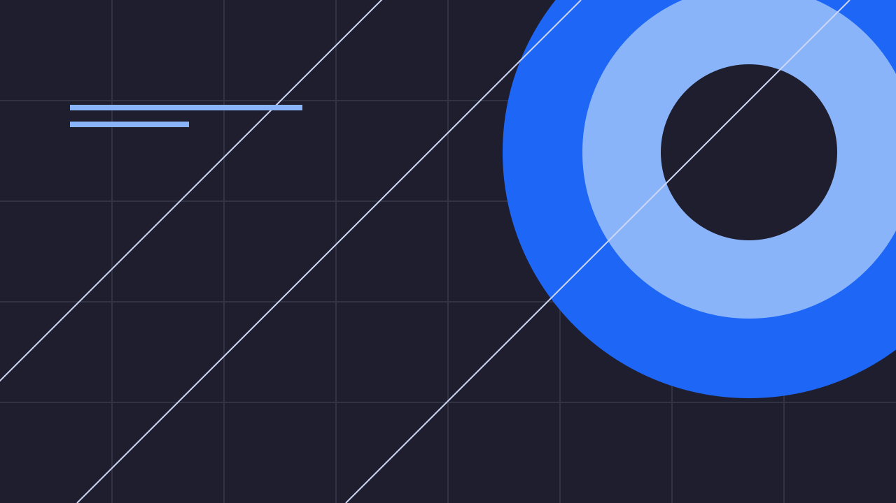
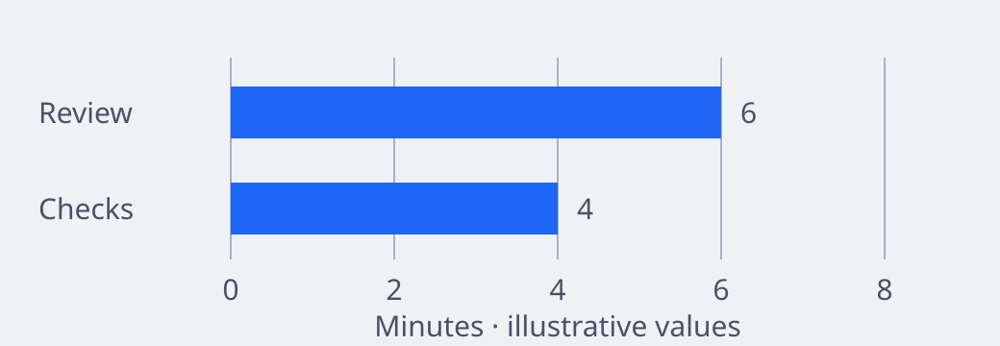

# Catppuccin slide layouts

Use one layout and one palette on each slide. The theme name is `catppuccin-slides` throughout the deck.

## Contents

- [Setup](#setup)
- [Layout selection](#layout-selection)
- [Colour roles](#colour-roles)
- [Opening](#opening)
- [Agenda](#agenda)
- [Section](#section)
- [Statement](#statement)
- [Two-column](#two-column)
- [Comparison](#comparison)
- [Evidence](#evidence)
- [Visual](#visual)
- [Split panels](#split-independent-full-height-panels)
- [Full-bleed media copy](#visual-optional-text-over-full-bleed-media)
- [Composable figures, lists and media](#composable-figures-lists-and-media)
- [Metrics](#metrics)
- [Process / timeline](#process--timeline)
- [Code](#code)
- [Architecture](#architecture)
- [Quote](#quote)
- [Closing / appendix](#closing--appendix)
- [Readability checks](#readability-checks)

## Setup

Start with `starters/latte.md`, `starters/mocha.md` or `starters/mixed.md`. Keep this frontmatter once, at the start:

```yaml
---
marp: true
theme: catppuccin-slides
size: 16:9
paginate: true
header: 'Team / Talk title'
footer: 'Presenter name · Event date'
---
```

Register `theme/catppuccin.css` with Marp. Enable HTML for these trusted templates because columns and captions use HTML wrappers.

Separate slides with `---`. Use `_class`, not `class`, for each slide. Always include `latte` or `mocha` with the layout class.

For dark variants, replace `latte` with `mocha` in the examples below. Do not repeat or change the global `theme` directive.

Keep blank lines around Markdown inside HTML wrappers. Use local image files and preserve their paths relative to the deck.

Use `Work Sans` for body text and `FiraCode Nerd Font Mono` for code. The theme does not fetch fonts or images.

## Layout selection

| Layout | Use | Content limit |
| --- | --- | --- |
| Opening | Establish the purpose | One title, one sentence |
| Agenda | Set the route | Three or four items |
| Section | Mark a transition | One short title |
| Statement | Make one claim | One claim, one qualifier |
| Two-column | Explain related ideas below a shared heading | Two short groups |
| Split | Separate full-height text or media panels | One title and three short items per panel |
| Comparison | Compare equal criteria | Three rows |
| Evidence | Explain one result | One measure, its limits, its source |
| Visual | Show full-bleed media | One caption, opening, statement, or image only |
| Metrics | Show exact values | Four rows |
| Process | Explain order or time | Four steps |
| Code | Explain a small example | Ten lines, about 70 characters per line |
| Architecture | Explain a request path | Three nodes and one boundary |
| Quote | Present a verified voice | About 30 words and attribution |
| Closing / appendix | Request action or support detail | One next action, or four reference items |

## Colour roles

Keep Blue `h1`, Peach `h2`, and Green `h3` separate from structural accents.
Do not use these heading colour families for decorative lines, dashes, dividers, or markers.
The top dash follows `--layout-accent`, not the heading colour.
Keep full-bleed media copy neutral until checked against each image. The skill's accessibility reference defines heading colours and contrast checks.
Header, footer and source text stay neutral, with Pink metadata dashes.
Links use neutral text with Pink underlines and focus outlines. General list markers and icons use Pink.
Page numbers use Yellow on Base in both palettes, independently of the layout accent.

| Layout family | Layout accent | Treatment |
| --- | --- | --- |
| Opening | Pink | Structural mark, separate Blue title |
| Agenda | Yellow | Large list numbers and row rules |
| Section | Yellow | Section eyebrow |
| Statement | Pink | Structural mark, Blue claim and bold emphasis |
| Two-column | Teal | Divider rule |
| Split | Teal | Layout rules where present, no default panel divider. Code edges stay Mauve. |
| Comparison | Teal | Table header rule, neutral labels |
| Evidence | Teal | Divider rule. Large measures use the separate Teal data role. |
| Visual | Pink | Caption edge, neutral overlay copy |
| Metrics | Teal | Table header rule, neutral values |
| Process / timeline | Mauve | Step rules, Yellow numbers, neutral labels |
| Code | Mauve | Block edge, language-aware syntax on a dark panel |
| Architecture | Mauve | Top borders and boundary rule, Yellow arrows, neutral labels |
| Quote | Pink | Quotation edge, neutral attribution |
| Closing / appendix | Pink | Closing action rule, quiet appendix variant |

`--brand` means the Pink structural accent, not the Blue heading role.
`--navigation` supplies Yellow to navigation and `--page-count`. `--code-rule` supplies Mauve to code borders, including split panels.
Both palettes use the same structural families. Latte uses contrast-adjusted Yellow and Pink, as the accessibility reference specifies.
Keep palette values unchanged. Override a role on the relevant slide only, after the theme's layout rules.
For example, `section.my-section { --layout-accent: var(--mauve); }` selects Mauve when the slide also has `my-section`.
Use existing theme roles rather than arbitrary colours. Recheck contrast after each override.
Reserve `--status-success`, `--status-warning` and `--status-danger` for labelled status, not decoration.
Keep chart data and syntax colours independent of structural accents.
For embedded diagrams, use structural accents for boundaries and connectors, with labelled semantic roles for data or status.

## Opening

```markdown
<!-- _class: latte opening -->
<!-- _paginate: false -->

<p class="eyebrow">Topic / Audience</p>

# Make the decision clear

<p class="lede">Explain why the audience needs to act.</p>
```

## Agenda

```markdown
<!-- _class: latte agenda -->

# The route to the decision

1. Define the problem
2. Read the evidence
3. Compare the options
4. Agree the next action
```

## Section

```markdown
<!-- _class: latte section -->

<p class="eyebrow">01 / Evidence</p>

# Test the claim

Name the question that follows.
```

## Statement

```markdown
<!-- _class: latte statement -->

# Reduce the work,<br>not the **confidence**

Add one condition or limit to the claim.
```

## Two-column

```markdown
<!-- _class: latte two-column -->

# Match the response to the problem

<div class="columns">
<div>

## Problem

Describe the constraint.

- Name its cost.
- Name who it affects.

</div>
<div>

## Response

Describe one bounded change.

- Name the owner.
- Name the measure.

</div>
</div>
```

## Comparison

```markdown
<!-- _class: latte comparison -->

# Compare the same criteria

| Criterion | Current | Proposed |
| :--- | :--- | :--- |
| Effort | Add a value | Add a value |
| Risk | State the risk | State the risk |
| Owner | Name the owner | Name the owner |

<p class="source">Source: title, date and link.</p>
```

## Evidence

```markdown
<!-- _class: latte evidence -->

# State one measured result

<div class="columns">
<div>

<p class="metric">00%</p>

Replace with a verified measure.

</div>
<div>

## What the result means

Define the sample and the baseline.

Explain the limits of the evidence.

</div>
</div>

<p class="source">Source: title, date, sample and link.</p>
```

## Visual

Copy `images/blue-study.svg` beside the deck in an `images/` directory, or use an approved local image. Adjust the path accordingly.

```markdown
<!-- _class: latte visual -->
<!-- _paginate: false -->



<div class="caption">

# State the visual conclusion

Describe the meaning, not only the appearance.

<p class="source">Image: creator, source and licence.</p>

</div>
```

The opaque caption preserves text contrast. `cover` crops the image. Use `bg contain` when the whole image must remain visible.

Marp backgrounds are decorative. Put essential image information in visible text and speaker notes. Do not use this layout for dense charts.

## Split: independent full-height panels

Use `split` instead of `two-column` when each half needs its own heading, alignment, or full-height image.
The default widths are equal. There is no gutter, shared heading, or divider.
Global headers, footers and pagination are hidden. Put necessary credits inside their associated panel.

```markdown
<!-- _class: latte split -->

<div class="split-panel panel-centre">
<div class="panel-body">

# Explain the choice

One short qualifier.

</div>
<p class="panel-source">Source: example only.</p>
</div>
<div class="split-panel panel-muted panel-top">
<div class="panel-body">

## Keep the scope clear

- Name the owner.
- Define the check.
- Record the result.

</div>
<p class="panel-source">Optional local source or URL.</p>
</div>
```

| Class | Place on | Effect |
| --- | --- | --- |
| `split-wide-left` | Slide, with `split` | Left:right widths of 5:3 |
| `split-wide-right` | Slide, with `split` | Left:right widths of 3:5 |
| `split-reverse` | Slide, with `split` | Swap the two panels, without changing physical widths |
| `panel-top` / `panel-bottom` | `.split-panel` | Align the body at the top or bottom, default is middle |
| `panel-centre` | `.split-panel` | Centre text horizontally |
| `panel-muted` | `.split-panel` | Use Mantle instead of Base |
| `panel-source` | Last paragraph in a panel | Reserve a separate bottom row for a source or link |

Keep exactly two `.split-panel` wrappers. Reversal changes visual order, not reading order.
Keep source order meaningful, or reorder the markup instead when sequence matters.
Each text panel has a 56px horizontal and 64px vertical safe area.
Use one short heading, at most three short items, and no more than two source lines.
Use the narrower panel for a short title or image, not a long list.

For code, put a fenced block inside `.panel-body`, with blank lines around the fence.
Keep code to eight lines and approximately 32 characters per line in an equal panel.
For longer code, use the existing full-width `code` family rather than smaller text.

Replace either panel with this contained image panel:

```html
<div class="split-panel panel-muted">

<p class="panel-source">Original sample artwork, not data.</p>
</div>
```

For an edge-to-edge photograph, use the following panel instead:

```html
<div class="split-panel panel-cover">

</div>
```

Replace the placeholder with an approved local photograph. Put its credit in the text panel or evidence record.
`panel-cover` is image-only. Do not put text over its image.
Contain screenshots, diagrams and logos. Cover photographs only when the crop preserves the subject and its context.
`--media-position` controls the focal point. Check the crop at the actual panel width, especially after reversal.

## Visual: optional text over full-bleed media

The original `visual` with `.caption` remains unchanged.
The following variants use a foreground `` so that informative media keeps its alternative text.
Do not combine these variants with Marp `bg` syntax or the `opening` and `statement` families.

```markdown
<!-- _class: mocha visual visual-opening -->
<!-- _paginate: false -->


<div class="visual-scrim" aria-hidden="true"></div>
<div class="visual-copy copy-top">

<p class="eyebrow">Topic / Audience</p>

# A title over a photograph

One short promise to the audience.

<p class="source">Presenter · Event · Image credit</p>
</div>
```

| Variant or utility | Use | Limit |
| --- | --- | --- |
| `visual-image` | Image only, omit scrim and copy wrappers | Give meaningful media descriptive `alt` text |
| `visual-opening` | Photograph-backed opening | One short title, qualifier and identity line |
| `visual-statement` | Statement over media | One short claim and optional qualifier |
| `copy-top` / `copy-bottom` | Vertical position on `.visual-copy` | Default is middle |
| `copy-right` / `copy-centre` | Horizontal position on `.visual-copy` | Default is left |
| `media-contain` | Class on `.visual-media` | Preserve the whole image instead of cover cropping |
| `visual-scrim` | Optional contrast layer before `.visual-copy` | Base colour at 90% opacity by default |

For image-only slides, retain the image element from the example and change the slide class to `latte visual visual-image`.
For statements, change the class to `latte visual visual-statement` and use `visual-copy copy-centre`.
The copy area stays 72px from the sides and 64px from the top and bottom, with an 800px text limit.
Put the title in quiet image space. Never obscure chart labels, faces, embedded text, or other essential information.
The optional scrim uses the active palette's Base colour. Set `style="--scrim-opacity: 0.9"` on that element to adjust it.
Recheck contrast over every part of the text after any opacity, crop, position, or image change.
Omit the scrim only when the actual image gives sufficient contrast. No transparent overlay guarantees contrast for arbitrary images.
If a scrim hides essential detail, use `split` instead.
Keep essential image meaning in alternative text, visible text, and the spoken explanation where needed.

## Composable figures, lists and media

These utilities do not add layout families. Combine them with a normal heading or an existing family as appropriate.

### Heading above a contained figure

```markdown
<!-- _class: latte -->

# Compare the queue lengths

<figure class="media-figure">

<figcaption>Illustrative minutes, not measured results. Both stages use the same scale.</figcaption>
</figure>
```

Use one heading line and one caption line. The figure reserves 438px, including its caption.
Keep screenshots and diagrams contained. Crop unnecessary application chrome in the source asset, not essential labels in CSS.
Internal labels need to remain readable at 1280 × 720. Use a simpler figure if they do not.

### Matched figures across consecutive slides

Add `figure-pair` to both slides from the preceding example.
Use `images/queue-before.svg` on the first and `images/queue-after.svg` on the second.
Update each alternative text and caption to match its values.
This modifier reserves two heading lines and a 414px figure area on each slide.
Keep both images' dimensions, axes, scale and caption line count identical.
Place state labels in the heading or caption, never across the plotted data.

### Icon-led list with hanging alignment

```html
<ul class="icon-list">
<li><span class="list-icon" aria-hidden="true">+</span><span><strong>Add a check.</strong> Keep the result with the change.</span></li>
<li><span class="list-icon" aria-hidden="true">→</span><span><strong>Review the result.</strong> Explain each exception.</span></li>
<li><span class="list-icon" aria-hidden="true">✓</span><span><strong>Record the decision.</strong> Name its owner.</span></li>
</ul>
```

Keep three or four short rows. The 40px icon column leaves wrapped text aligned with the first line.
Icons supplement the words. Hide decorative icons from assistive technology and do not rely on emoji colour or font availability.

### Optional gallery or portrait strip

```html
<div class="media-strip">


</div>
```

The strip has three equal cells, 180px high, with 16px gaps. Use `media-cover` only for intentional photographic crops.
For portraits, preserve faces and give each person an appropriate name or description. Do not add circular masks by default.
Use one strip below a short list, or inside a split panel with enough space.
Thumbnails are supporting images, not the only readable version of a chart or screenshot.

All bundled SVGs are original illustrative assets. No artwork comes from the reviewed talks.
Keep approved local assets beside the deck and copy each used file into its `images/` directory.
Export reviewed markup with `scripts/export.py --trusted-local-assets --formats html notes` and the required input/output paths.
The helper embeds assets and fonts for offline HTML. Check the isolated HTML with network access blocked before delivery.

## Metrics

```markdown
<!-- _class: latte metrics -->

# Give the values clear units

| Measure | Baseline | Current |
| :--- | ---: | ---: |
| Time | 00 min | 00 min |
| Count | 00 | 00 |
| Cost | £00 | £00 |

<p class="source">Replace all values. Define the period and sample.</p>
```

## Process / timeline

```markdown
<!-- _class: latte process -->

# Four steps, one review point

1. **Define**<br>Agree the question.
2. **Build**<br>Test one small change.
3. **Measure**<br>Compare the result.
4. **Decide**<br>Continue, revise or stop.
```

For a timeline, replace the bold step names with dates. Keep four steps or split the sequence across slides.

## Code

````markdown
<!-- _class: latte code -->

# Explain one operation

```python
from statistics import median

samples = [32, 34, 36]
print(median(samples))
```

<p class="source">Python · Example only · Explain inputs and output.</p>
````

Keep the recognised language label on each code fence, including fences inside split panels.
Use `text` or `plaintext` for intentional neutral output. The authoring reference defines language handling and fallback behaviour.
Do not apply an external syntax theme without a contrast check.

## Architecture

```markdown
<!-- _class: latte architecture -->

# Show the request direction

1. **1. Client**<br>Sends the request.
2. **2. Service**<br>Validates the input.
3. **3. Store**<br>Saves the result.

<p class="boundary">Trust boundary: validate client input before each write.</p>

<p class="source">Example flow. Describe any omitted dependencies in the notes.</p>
```

Use a local SVG with a visible description for a more complex architecture. Do not compress a full system into three boxes.

## Quote

```markdown
<!-- _class: latte quote -->

<p class="eyebrow">A voice from the review</p>

> “Replace with an exact, verified quotation.”

<p class="source">Name · Role · Source · Date</p>
```

## Closing / appendix

```markdown
<!-- _class: latte closing -->

<p class="eyebrow">Decision / Next action</p>

# Ask for one clear action

<p class="lede">Name the owner and the review date.</p>

<p class="next"><strong>Next:</strong> State the smallest useful action.</p>

---

<!-- _class: latte appendix -->

# Appendix: evidence and method

- Link the primary source.
- Define the sample.
- Explain the calculation.
- Record the exclusions.
```

## Readability checks

The canvas is 1280 × 720. Main text is 30px, with 72px side margins. Keep content above the footer.

Small labels, sources and link text use Text or Subtext 1, except Yellow navigation labels and page numbers.
Code tokens and neutral fallback text need separate checks against the dark code panel.
Require at least 4.5:1 for small text and 3:1 for large text or meaning-carrying marks.

| Latte role | Contrast on Base | Safe use |
| --- | --- | --- |
| Blue heading | 4.34:1 | Large `h1`, not small text or structural marks |
| Derived Yellow navigation | 5.59:1 | Agenda numbers, section eyebrows, pagination and process numbers |
| Derived Pink structure | 4.98:1 | Metadata dashes, link underlines, focus outlines, list markers and decorative edges |
| Teal comparison / data | 3.31:1 | Large measures and rules, not small text |
| Mauve technical structure | 4.79:1 | Code borders and technical boundaries |

These ratios apply to Base only. Check each actual background, including Mantle and the dark code panel.
Latte Mauve falls to about 4.45:1 on Mantle. Keep small panel labels neutral.
Do not use colour alone for status or chart meaning. Add labels and contrasting outlines where required.

Split panel backgrounds use Base or Mantle, not an arbitrary tint. Code blocks use a separate dark panel.
Check contrast again if a panel colour changes.

Shorten or split content when it does not fit. Do not reduce the whole slide's type size to fit extra text.

Render `specimen.md` after theme changes. Inspect both palettes, code, tables, captions, footers and page numbers before export.
