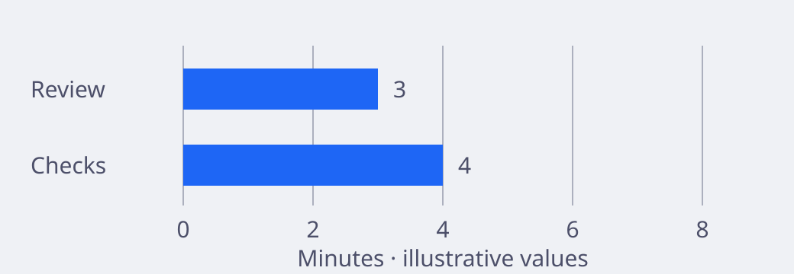
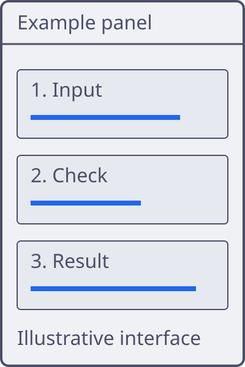

<!-- _class: latte opening -->
<!-- _paginate: false -->

<p class="eyebrow">Latte / Opening</p>

# Make the next decision clear

<p class="lede">A practical system for evidence, technical detail and a clear next action.</p>

<p class="source">Presenter name · Team · Event date</p>

---

<!-- _class: mocha opening -->
<!-- _paginate: false -->

<p class="eyebrow">Mocha / Opening</p>

# Make the next decision clear

<p class="lede">A practical system for evidence, technical detail and a clear next action.</p>

<p class="source">Presenter name · Team · Event date</p>

---

<!-- _class: latte visual visual-opening -->
<!-- _paginate: false -->


<div class="visual-scrim" aria-hidden="true"></div>
<div class="visual-copy copy-top">
<p class="eyebrow">Latte / Photograph-backed opening</p>

# A clear place to begin

One promise, with space around the title.

<p class="source">Original illustration · Replace with an approved photograph</p>
</div>

<!--
The image supplies context, but the **title comes first**.
The pale contrast layer makes the dark text readable without an opaque caption box.
-->

---

<!-- _class: mocha visual visual-opening -->
<!-- _paginate: false -->


<div class="visual-scrim" aria-hidden="true"></div>
<div class="visual-copy copy-bottom copy-right">
<p class="eyebrow">Mocha / Photograph-backed opening</p>

# A clear place to begin

One promise, with space around the title.

<p class="source">Original illustration · Replace with an approved photograph</p>
</div>

<!--
The image supplies context, but the **title comes first**.
The dark contrast layer makes the pale text readable without an opaque caption box.
-->

---

<!-- _class: latte visual visual-image -->
<!-- _paginate: false -->


<!--
An **image-only pause** gives the audience time to look.
Here, layered blue hills demonstrate the full frame without extra text.
-->

---

<!-- _class: mocha visual visual-image -->
<!-- _paginate: false -->


<!--
An **image-only pause** gives the audience time to look.
Here, layered blue hills demonstrate the full frame without extra text.
-->

---

<!-- _class: latte agenda -->

# A route to the decision

1. Define the problem
2. Read the evidence
3. Compare the options
4. Agree the next action

---

<!-- _class: mocha agenda -->

# A route to the decision

1. Define the problem
2. Read the evidence
3. Compare the options
4. Agree the next action

---

<!-- _class: latte section -->

<p class="eyebrow">01 / Section</p>

# Start with the evidence

One question. A bounded claim. A source that the audience can check.

---

<!-- _class: mocha section -->

<p class="eyebrow">01 / Section</p>

# Start with the evidence

One question. A bounded claim. A source that the audience can check.

---

<!-- _class: latte statement -->

# Reduce the work,<br>not the **confidence**

Use this layout for one claim, not a compressed summary of the whole talk.

---

<!-- _class: mocha statement -->

# Reduce the work,<br>not the **confidence**

Use this layout for one claim, not a compressed summary of the whole talk.

---

<!-- _class: latte visual visual-statement -->
<!-- _paginate: false -->


<div class="visual-scrim" aria-hidden="true"></div>
<div class="visual-copy copy-centre">

# One idea deserves<br>the whole frame

Illustrative statement over media.

<p class="source">Latte · Original illustration, not evidence</p>
</div>

<!--
The statement carries **one idea** rather than a list of details.
If the image contains evidence, we must leave that evidence unobscured.
-->

---

<!-- _class: mocha visual visual-statement -->
<!-- _paginate: false -->


<div class="visual-scrim" aria-hidden="true"></div>
<div class="visual-copy copy-centre">

# One idea deserves<br>the whole frame

Illustrative statement over media.

<p class="source">Mocha · Original illustration, not evidence</p>
</div>

<!--
The statement carries **one idea** rather than a list of details.
If the image contains evidence, we must leave that evidence unobscured.
-->

---

<!-- _class: latte two-column -->

# Separate the problem from the response

<div class="columns">
<div>

## The problem

Manual checks vary between teams.

- Results are hard to repeat.
- Review time is unpredictable.
- Evidence is easy to lose.

</div>
<div>

## The response

Use one repeatable check before review.

- Keep the result with the change.
- Explain each failed check.
- Leave judgement to the reviewer.

</div>
</div>

---

<!-- _class: mocha two-column -->

# Separate the problem from the response

<div class="columns">
<div>

## The problem

Manual checks vary between teams.

- Results are hard to repeat.
- Review time is unpredictable.
- Evidence is easy to lose.

</div>
<div>

## The response

Use one repeatable check before review.

- Keep the result with the change.
- Explain each failed check.
- Leave judgement to the reviewer.

</div>
</div>

---

<!-- _class: latte split -->

<div class="split-panel panel-centre">
<div class="panel-body">

# Two independent panels

Equal widths, separate alignment.

</div>
<p class="panel-source">Latte · Split · Illustrative text</p>
</div>
<div class="split-panel panel-muted panel-top">
<div class="panel-body">

## Keep the scope clear

- Name the owner.
- Define the check.
- Record the result.

</div>
<p class="panel-source">Local source: example only.</p>
</div>

<!--
The title and the list have **separate positions**.
The source stays below its own content, so the audience knows which claim it supports.
-->

---

<!-- _class: mocha split -->

<div class="split-panel panel-centre">
<div class="panel-body">

# Two independent panels

Equal widths, separate alignment.

</div>
<p class="panel-source">Mocha · Split · Illustrative text</p>
</div>
<div class="split-panel panel-muted panel-top">
<div class="panel-body">

## Keep the scope clear

- Name the owner.
- Define the check.
- Record the result.

</div>
<p class="panel-source">Local source: example only.</p>
</div>

<!--
The title and the list have **separate positions**.
The source stays below its own content, so the audience knows which claim it supports.
-->

---

<!-- _class: latte -->

# Make the hierarchy visible

## Group the evidence

### Define the sample

The title is Blue, the group is Peach, and the detail is Green.
Size and weight preserve the order without colour.

<p class="source">Latte · Semantic h1, h2 and h3 · Accessible heading roles derived from the official palette</p>

<!--
Each heading level has a **different purpose**, not only a different colour.
The smaller headings divide the evidence into groups and details.
Their size and weight keep the order clear in a monochrome copy.
-->

---

<!-- _class: mocha -->

# Make the hierarchy visible

## Group the evidence

### Define the sample

The title is Blue, the group is Peach, and the detail is Green.
Size and weight preserve the order without colour.

<p class="source">Mocha · Semantic h1, h2 and h3 · Official palette colours on Base</p>

<!--
The **same heading roles** apply to the dark palette.
The colours change with the surface, but the reading order stays the same.
-->

---

<!-- _class: latte -->

# Keep words aligned with their icons

<ul class="icon-list">
<li><span class="list-icon" aria-hidden="true">+</span><span><strong>Add a check.</strong> Keep its result with the change.</span></li>
<li><span class="list-icon" aria-hidden="true">→</span><span><strong>Review the result.</strong> Explain each exception before the next decision.</span></li>
<li><span class="list-icon" aria-hidden="true">✓</span><span><strong>Record the decision.</strong> Name the owner.</span></li>
</ul>
<div class="media-strip">


</div>
<p class="source">Latte · Original illustrations · Optional strip with explicit contain and cover choices</p>

<!--
The icons help us scan, but **the words carry the meaning**.
The strip shows that containment preserves the full image while a crop fills its cell.
-->

---

<!-- _class: mocha -->

# Keep words aligned with their icons

<ul class="icon-list">
<li><span class="list-icon" aria-hidden="true">+</span><span><strong>Add a check.</strong> Keep its result with the change.</span></li>
<li><span class="list-icon" aria-hidden="true">→</span><span><strong>Review the result.</strong> Explain each exception before the next decision.</span></li>
<li><span class="list-icon" aria-hidden="true">✓</span><span><strong>Record the decision.</strong> Name the owner.</span></li>
</ul>
<div class="media-strip">


</div>
<p class="source">Mocha · Original illustrations · Optional strip with explicit contain and cover choices</p>

<!--
The icons help us scan, but **the words carry the meaning**.
The strip shows that containment preserves the full image while a crop fills its cell.
-->

---

<!-- _class: latte comparison -->

# Compare the same criteria

| Criterion | Manual review | Repeatable check |
| :--- | :--- | :--- |
| Timing | At each handover | Before handover |
| Evidence | Separate notes | Saved with the change |
| Human role | Repeat routine checks | Review the exceptions |

<p class="source">Example comparison. Validate these claims for the actual workflow.</p>

---

<!-- _class: mocha comparison -->

# Compare the same criteria

| Criterion | Manual review | Repeatable check |
| :--- | :--- | :--- |
| Timing | At each handover | Before handover |
| Evidence | Separate notes | Saved with the change |
| Human role | Repeat routine checks | Review the exceptions |

<p class="source">Example comparison. Validate these claims for the actual workflow.</p>

---

<!-- _class: latte evidence -->

<!--
These figures are **illustrative**, so they do not prove that the change works.
A lower median tells us about the middle result, not every review.
Before we recommend wider use, we need **measured results** from comparable work.
-->

# Review time fell in the pilot

<div class="columns">
<div>

<p class="metric">32%</p>

Less median review time in the example dataset.

</div>
<div>

## A result with limits

The sample includes 40 changes across two teams.

The result does not establish that all teams will see the same reduction.

</div>
</div>

<p class="source">Illustrative data · Baseline: 50 minutes · Pilot: 34 minutes · Not a measured result</p>

---

<!-- _class: mocha evidence -->

# Review time fell in the pilot

<div class="columns">
<div>

<p class="metric">32%</p>

Less median review time in the example dataset.

</div>
<div>

## A result with limits

The sample includes 40 changes across two teams.

The result does not establish that all teams will see the same reduction.

</div>
</div>

<p class="source">Illustrative data · Baseline: 50 minutes · Pilot: 34 minutes · Not a measured result</p>

---

<!-- _class: latte metrics -->

# Read the values, then the trade-off

| Measure | Baseline | Pilot | Change |
| :--- | ---: | ---: | ---: |
| Median review time | 50 min | 34 min | −32% |
| Changes per sample | 40 | 40 | 0 |
| Checks per change | 6 | 6 | 0 |
| Teams in sample | 2 | 2 | 0 |

<p class="source">Illustrative data, not a measured result. Equal counts do not establish comparable samples.</p>

---

<!-- _class: mocha metrics -->

# Read the values, then the trade-off

| Measure | Baseline | Pilot | Change |
| :--- | ---: | ---: | ---: |
| Median review time | 50 min | 34 min | −32% |
| Changes per sample | 40 | 40 | 0 |
| Checks per change | 6 | 6 | 0 |
| Teams in sample | 2 | 2 | 0 |

<p class="source">Illustrative data, not a measured result. Equal counts do not establish comparable samples.</p>

---

<!-- _class: latte figure-pair -->

# Before: a longer review queue

<figure class="media-figure">

<figcaption>Latte · Before · Illustrative values, not measured results.</figcaption>
</figure>

<!--
These are **illustrative values**, not evidence of an improvement.
Keep the scale in mind as we move to the After image.
-->

---

<!-- _class: mocha figure-pair -->

# Before: a longer review queue

<figure class="media-figure">

<figcaption>Mocha · Before · Illustrative values, not measured results.</figcaption>
</figure>

<!--
These are **illustrative values**, not evidence of an improvement.
Keep the scale in mind as we move to the After image.
-->

---

<!-- _class: latte figure-pair -->

# After: the same scale

<figure class="media-figure">

<figcaption>Latte · After · Illustrative values, not measured results.</figcaption>
</figure>

<!--
The **fixed scale** lets us compare the two images without adjusting for a new frame.
Only the illustrative review value changes.
-->

---

<!-- _class: mocha figure-pair -->

# After: the same scale

<figure class="media-figure">

<figcaption>Mocha · After · Illustrative values, not measured results.</figcaption>
</figure>

<!--
The **fixed scale** lets us compare the two images without adjusting for a new frame.
Only the illustrative review value changes.
-->

---

<!-- _class: latte quote -->

<p class="eyebrow">A voice from the review</p>

> “Show me what changed, what you checked and what you need me to decide.”

<p class="source">Example wording, not a sourced quotation · Replace with a named, verified source.</p>

---

<!-- _class: mocha quote -->

<p class="eyebrow">A voice from the review</p>

> “Show me what changed, what you checked and what you need me to decide.”

<p class="source">Example wording, not a sourced quotation · Replace with a named, verified source.</p>

---

<!-- _class: latte process -->

# Four steps, one review point

1. **Define**<br>Agree the question and the success measure.
2. **Build**<br>Test the smallest useful change.
3. **Measure**<br>Compare the result with the baseline.
4. **Decide**<br>Continue, revise or stop.

<p class="source">Use dates instead of step names for a timeline. Keep each step to two short sentences.</p>

---

<!-- _class: mocha process -->

# Four steps, one review point

1. **Define**<br>Agree the question and the success measure.
2. **Build**<br>Test the smallest useful change.
3. **Measure**<br>Compare the result with the baseline.
4. **Decide**<br>Continue, revise or stop.

<p class="source">Use dates instead of step names for a timeline. Keep each step to two short sentences.</p>

---

<!-- _class: latte architecture -->

# Keep the request path explicit

1. **1. Client**<br>Sends a request with a stable identifier.
2. **2. Service**<br>Validates the request and applies the policy.
3. **3. Store**<br>Saves the result and its audit record.

<p class="boundary">Trust boundary: the service validates all client input before it writes to the store.</p>

<p class="source">Example request flow · Arrows show request direction, not physical network connections.</p>

---

<!-- _class: mocha architecture -->

# Keep the request path explicit

1. **1. Client**<br>Sends a request with a stable identifier.
2. **2. Service**<br>Validates the request and applies the policy.
3. **3. Store**<br>Saves the result and its audit record.

<p class="boundary">Trust boundary: the service validates all client input before it writes to the store.</p>

<p class="source">Example request flow · Arrows show request direction, not physical network connections.</p>

---

<!-- _class: latte code -->

# Keep the check easy to read

```python
from statistics import median

baseline = [48, 50, 52]
pilot = [32, 34, 36]
reduction = 1 - median(pilot) / median(baseline)

print(f"Review time fell by {reduction:.0%}")
```

<p class="source">Python · Illustrative calculation · Keep code to 10 lines and approximately 70 characters per line.</p>

---

<!-- _class: mocha code -->

# Keep the check easy to read

```python
from statistics import median

baseline = [48, 50, 52]
pilot = [32, 34, 36]
reduction = 1 - median(pilot) / median(baseline)

print(f"Review time fell by {reduction:.0%}")
```

<p class="source">Python · Illustrative calculation · Keep code to 10 lines and approximately 70 characters per line.</p>

---

<!-- _class: latte split -->

<div class="split-panel panel-bottom">
<div class="panel-body">

# Explain one operation

A short example beside its purpose.

</div>
<p class="panel-source">Latte · Bottom-aligned text</p>
</div>
<div class="split-panel panel-muted">
<div class="panel-body">

## A repeatable check

```python
# Add the sample values.
def total(values):
    return sum(values)

samples = [2, 4, 6]
print("Total:", total(samples))
```

</div>
<p class="panel-source">Python · Illustrative input</p>
</div>

<!--
The code shows **one operation** with inputs that we can read at a glance.
Longer examples need another slide, not smaller type.
-->

---

<!-- _class: mocha split -->

<div class="split-panel panel-bottom">
<div class="panel-body">

# Explain one operation

A short example beside its purpose.

</div>
<p class="panel-source">Mocha · Bottom-aligned text</p>
</div>
<div class="split-panel panel-muted">
<div class="panel-body">

## A repeatable check

```python
# Add the sample values.
def total(values):
    return sum(values)

samples = [2, 4, 6]
print("Total:", total(samples))
```

</div>
<p class="panel-source">Python · Illustrative input</p>
</div>

<!--
The code shows **one operation** with inputs that we can read at a glance.
Longer examples need another slide, not smaller type.
-->

---

<!-- _class: latte code -->

# Read the tokens, then the result

```python
# An illustrative threshold, not a policy.
class Review:
    def summary(self, count=3):
        if count > 0:
            return f"Ready: {count} changes"
        return "No changes"

print(Review().summary())
```

<p class="source">Latte · Python · Keywords, strings, numbers, comments and titles on a fixed Mocha code surface</p>

<!--
A **recognised language label** enables syntax colour without guessing.
The dark code surface keeps every token readable on either slide palette.
Inline code stays separate from this block style.
-->

---

<!-- _class: mocha code -->

# Read the tokens, then the result

```python
# An illustrative threshold, not a policy.
class Review:
    def summary(self, count=3):
        if count > 0:
            return f"Ready: {count} changes"
        return "No changes"

print(Review().summary())
```

<p class="source">Mocha · Python · The same token colours and code surface as Latte</p>

<!--
The **fixed code palette** makes examples consistent across light and dark slides.
Comments and punctuation remain readable, even though they attract less attention than strings and keywords.
-->

---

<!-- _class: latte split split-wide-left -->

<div class="split-panel">
<div class="panel-body">

# Keep the image whole

Containment preserves the complete composition.

</div>
<p class="panel-source">Latte · 5:3 split · Original sample art</p>
</div>
<div class="split-panel panel-muted">

<p class="panel-source">Contained image, not data.</p>
</div>

<!--
A logo or screenshot needs **all its edges**.
The image can use the panel height without losing information to a crop.
-->

---

<!-- _class: mocha split split-wide-left -->

<div class="split-panel">
<div class="panel-body">

# Keep the image whole

Containment preserves the complete composition.

</div>
<p class="panel-source">Mocha · 5:3 split · Original sample art</p>
</div>
<div class="split-panel panel-muted">

<p class="panel-source">Contained image, not data.</p>
</div>

<!--
A logo or screenshot needs **all its edges**.
The image can use the panel height without losing information to a crop.
-->

---

<!-- _class: latte split split-wide-right split-reverse -->

<div class="split-panel">
<div class="panel-body">

# Give the subject room

The image fills the narrow panel. The words keep their safe area.

</div>
<p class="panel-source">Latte · Reversed 3:5 split · Original illustration</p>
</div>
<div class="split-panel panel-cover">

</div>

<!--
This illustration stands in for an approved photograph.
A **deliberate crop** keeps the subject visible while the text remains separate.
-->

---

<!-- _class: mocha split split-wide-right split-reverse -->

<div class="split-panel">
<div class="panel-body">

# Give the subject room

The image fills the narrow panel. The words keep their safe area.

</div>
<p class="panel-source">Mocha · Reversed 3:5 split · Original illustration</p>
</div>
<div class="split-panel panel-cover">

</div>

<!--
This illustration stands in for an approved photograph.
A **deliberate crop** keeps the subject visible while the text remains separate.
-->

---

<!-- _class: latte visual -->
<!-- _paginate: false -->


<div class="caption">

# Give the visual room

Keep the conclusion on an opaque caption, not directly over a busy image.

<p class="source">Original sample artwork · Decorative geometry, not data</p>

</div>

---

<!-- _class: mocha visual -->
<!-- _paginate: false -->


<div class="caption">

# Give the visual room

Keep the conclusion on an opaque caption, not directly over a busy image.

<p class="source">Original sample artwork · Decorative geometry, not data</p>

</div>

---

<!-- _class: latte closing -->

<p class="eyebrow">Decision / Next action</p>

# Test one bounded change

<p class="lede">Agree the owner, the measure and the review date.</p>

<p class="next"><strong>Next:</strong> Select one team for a two-week pilot.</p>

---

<!-- _class: mocha closing -->

<p class="eyebrow">Decision / Next action</p>

# Test one bounded change

<p class="lede">Agree the owner, the measure and the review date.</p>

<p class="next"><strong>Next:</strong> Select one team for a two-week pilot.</p>

---

<!-- _class: latte appendix -->

# Appendix: make the evidence traceable

- Link the source and record its date.
- Define the sample and the exclusions.
- Explain the calculation and its units.
- Keep detailed data outside the main narrative.

<p class="source">Appendix is a modifier for the closing family. This slide also checks the standard content layout.</p>

---

<!-- _class: mocha appendix -->

# Appendix: make the evidence traceable

- Link the source and record its date.
- Define the sample and the exclusions.
- Explain the calculation and its units.
- Keep detailed data outside the main narrative.

<p class="source">Appendix is a modifier for the closing family. This slide also checks the standard content layout.</p>
